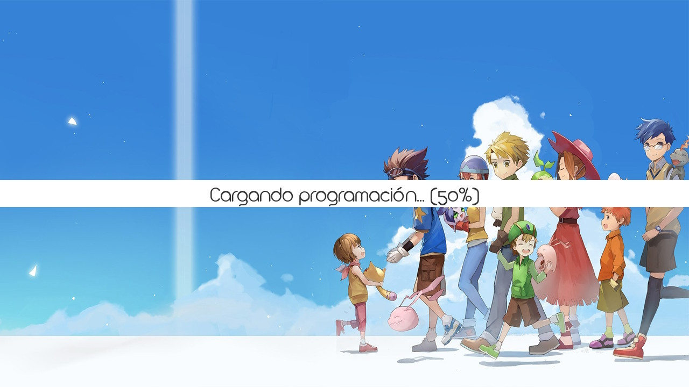
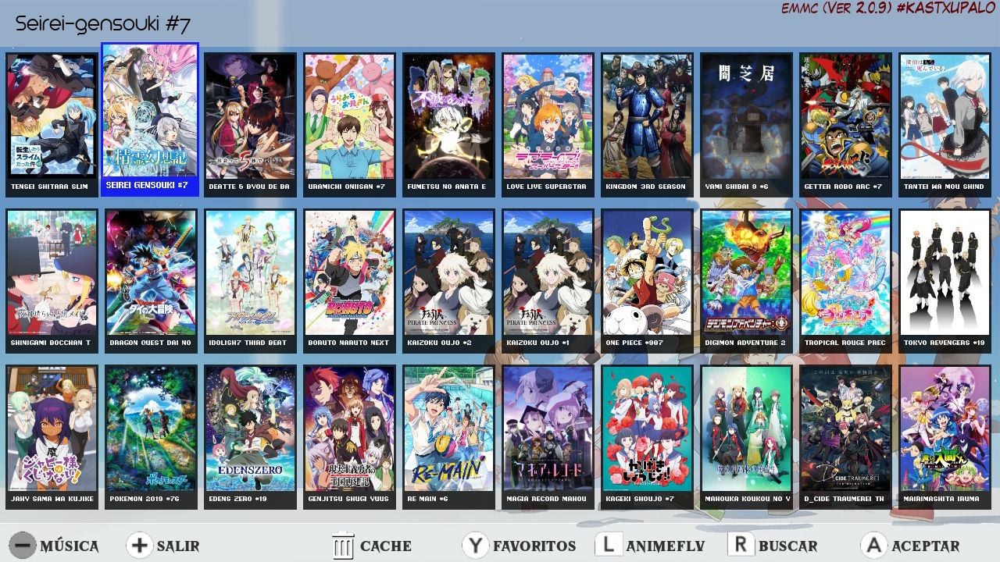
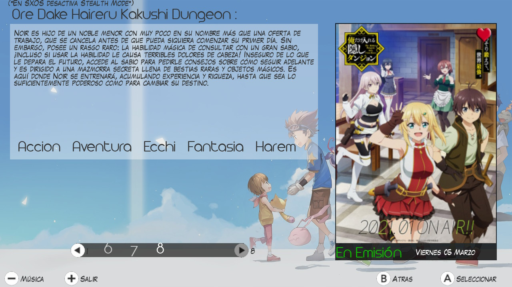
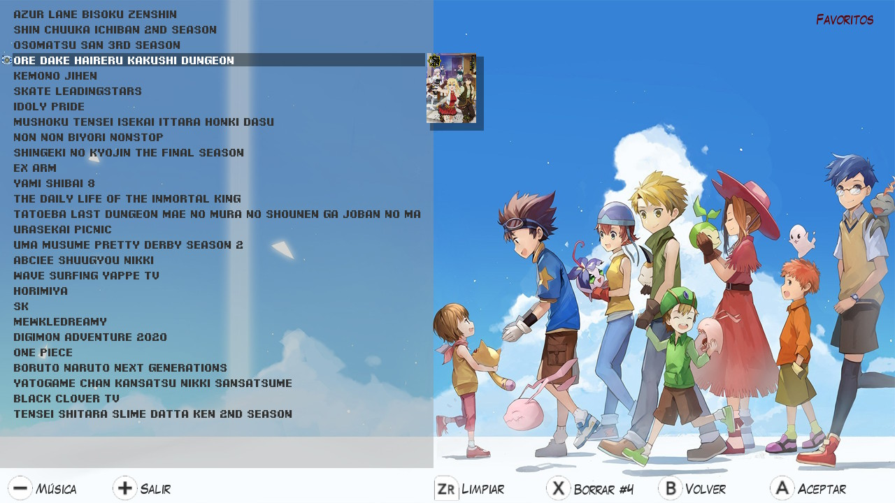
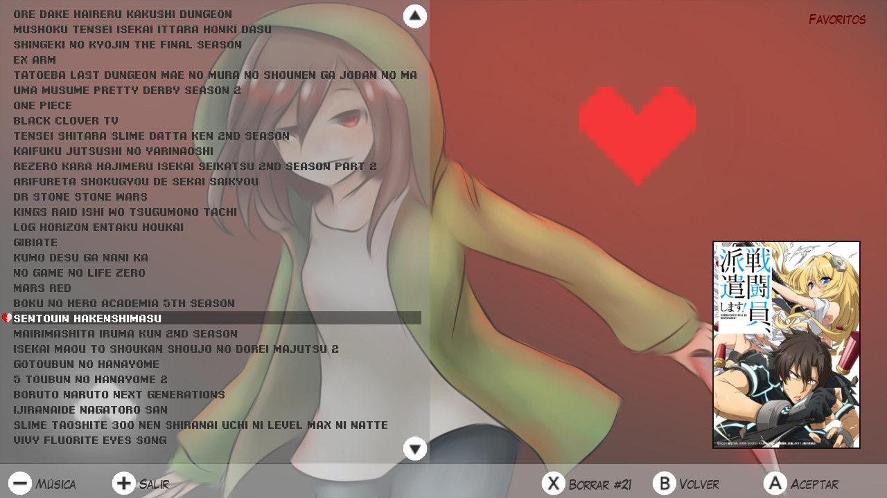
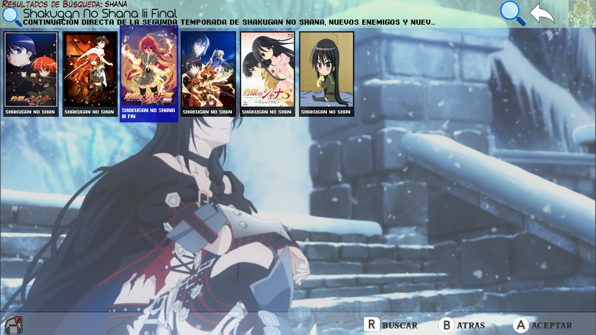
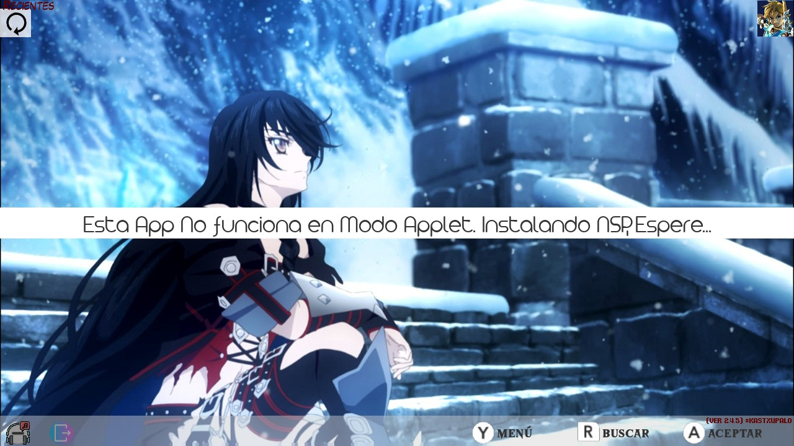

# RipJKAnimeNX 
 App de [JKAnime](https://jkanime.net/) para Nintendo Switch
----------------------------------------
Esta Aplicación es para Ver Online y Descargar Anime a través de la Nintendo Switch.

</img> </img> </img> </img> </img> </img> </img> </img>


### Para instalarlo Solo deberás de:
* Copiar [RipJKAnimeNX.nro](/out/RipJKAnimeNX.nro?raw=true)  en /switch/ y abrirlo una vez desde el Álbum esto instalara el icono en el Home.
* * Solo debes hacer esto una vez a menos que pierdas el icono del Home 
<details>
  <summary>Metodo Alternativo</summary>
 <li> Copiar el archivo <a href="/out/RipJKAnimeNX[05B9DB505ABBE000][v0].nsp?raw=true">RipJKAnimeNX[05B9DB505ABBE000][v0].nsp</a>  en la SD.</li>
 <li> Instalar el RipJKAnime NX[05B9DB505ABBE000][v0].nsp Con GoldLeaf o Awoo-installer</li>
</details>

## Actualizar la app
* Esta Aplicacion se Actualiza de forma automática para que tengas siempre la ultima versión
* Si tienes 2.2.8 o superior es simple resiviras el update de forma automatica solo debes abrir la app con internet


* * veras la version aumentar luego que la flecha deje de girar , deberas abrirla de nuevo para ver los cambios
* Si usas una version inferior deberas o bien instalar el nsp o abrir el nro desde el album para obtener la ultima

* * (A menos que se desactive deliberadamente)
# A tener en cuenta
* Esta app no funciona correctamente en modo applet (desde el album) porque requiere mas memoria y del uso del navegador 
* Debes usar lo básico antibaneo (dns, incógnito ,[host](https://github.com/darkxex/RipJKAnimeNX/raw/master/romfs/default.txt) de atmosphere,etc)
* Necesita Si o Si Internet 
* Para ver Animes descargados puedes usar [PPlay](https://github.com/Cpasjuste/pplay/) se guardan en la Raíz de la sd /Videos/


<details>
  <summary>Como Compilar, Devs</summary>

# Compilar 
esta app hace uso de [nspmini](https://github.com/StarDustCFW/nspmini) como librería
```sh
# Deberás usar los siguientes comandos para instalar nspmini en devkitpro
# ya q no viene de serie
git clone https://github.com/StarDustCFW/nspmini
make -C nspmini portlib

# Compilar NRO
make

# Compilar NRO y NSP
make NSP

``` 
</details>


<details>
  <summary>ToDo</summary>
 
## ToDo
- [x] **Gestor de Pieles**
- [ ] **Gestionar la UI de forma mas simple**
- [ ] **Sección de ajustes**
- [ ] **Abrir PPLAY desde la app**
- [ ] **Integrar un reproductor interno**
- [ ] **Crear Salvas de Usuario si no existen**
- [ ] **Utilizar OpenGL**
### Done 
- [x] **Que la app no se congele al usar el navegador**
- [x] **Agregar slideshow**
- [x] **Agregar sección de recomendados**
- [x] **Gestionar la interfaz de decargas**
- [x] **Cargar luego del vector #30**
- [x] **Agregar Eliminar Cache**
- [x] **Añadir Sección de Programación semanal**
- [x] **Agregar un Historial**
- [x] **Crear un Auto Actualizador**
- [x] **Auto instalar el nsp cuando se actualizá**
- [x] **Hacer una lista de imágenes en lugar de plana**
</details>
